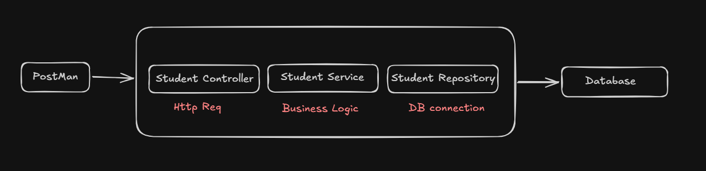
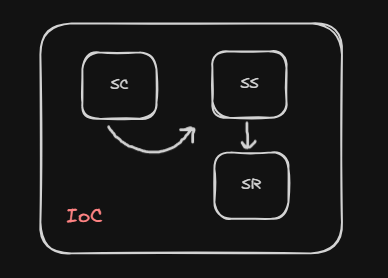
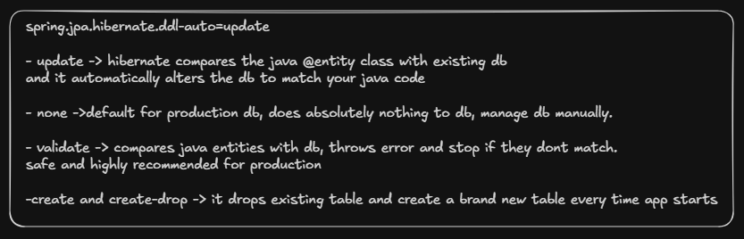

# SpringBoot 

## Restcontroller 
It marks the class which handles the incoming requests.

### @RestController
- marks class as entry point for client communication.
    - It's a specialized form of Spring's `@Controller` combined implicitly with `@ResponseBody`

### @Service
- Designates a class as the 'brain' or The business logic driver of your application.

### @Repository
- marks the class or interface as a Data Access Object (DAO) that communication directly with database.


## Jackson 
It converts JSON <-> Java Objects

 - It is primarily responsible for converting Java objects into JSON strings (Serialization) and translating incoming JSON request data back into Java objects (Deserialization) 


## createdAt and updatedAt
we will use LocalDateTime for this.
```
student.setUpdatedAt(LocalDateTime.now());
```

or we can use annotation such as
`@CreationTimestamp` and `@UpdateTimestamp` so it will be automatically updated.

## LOMBOK
Dependency used for providing annotation for setters and getters, which improves code visibility.


## Exception

`throws` and `throw`:

```
    private Student findStudentById(int id) throws Exception {
        Optional<Student> student = studentRepository.findById(id);
        if(student.isEmpty()){
            throw new Exception("Student not found"); 
        }
        return student.get();
    }
```
- Notice `throws` and `throw` these go together because `Exception` is `Checked`.

``` 
    private Student findStudentById(int id) {
        Optional<Student> student = studentRepository.findById(id);
        if(student.isEmpty()){
            throw new RuntimeException("Student not found"); 
        }
        return student.get();
    }
```
- But here we are only using `throw` because `RuntimeException` is a `unchecked`.


### Detail:
 - StudentServer X(Not used)   -> StudentController 
 - StudentRepository -> it should be interface and its method should be implemented by other class.
 - H2 Database, saves the data into RAM. You can also change it to files from mem(memory ram).
   changes to be done:
   ```bash
        # In-Memory Configuration (Data is lost on restart)
        spring.datasource.url=jdbc:h2:mem:testdb

        # File-Based Configuration (Data persists in your user current working directory as test.mv.db)
        spring.datasource.url=jdbc:h2:file:./test
   ```

## Related Images

<div> 
    <p>Flow of springboot</p>
    
    
    <p>Spring auto update DDL config details</p>
     
</div>